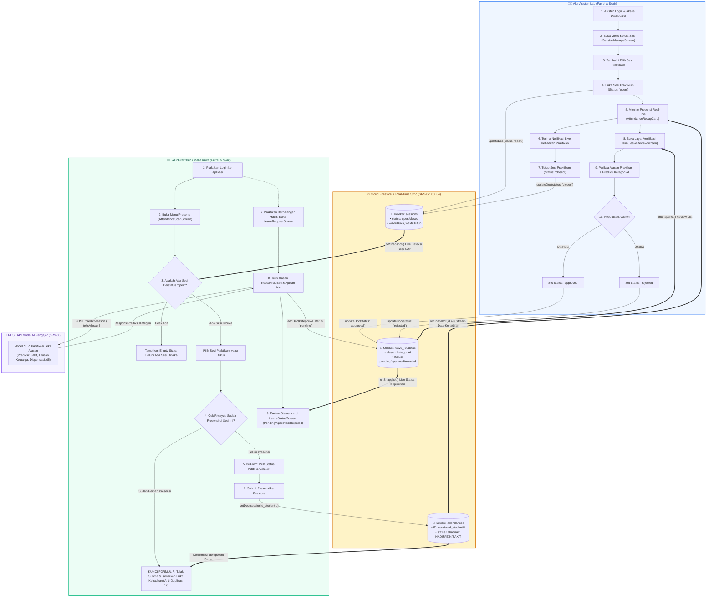

# Diagram Workflow Terpadu Sistem Presensi Praktikum (Sprint 2)

Salin seluruh blok kode Mermaid di bawah ini dan tempelkan langsung ke [Mermaid Live Editor](https://mermaid.live).

```mermaid
flowchart TD
    %% PENETAPAN SUBGRAPH PERAN & SISTEM
    subgraph ASISTEN ["🧑‍🏫 Alur Asisten Lab (Farrel & Syair)"]
        A1["1. Asisten Login & Akses Dashboard"] --> A2["2. Buka Menu Kelola Sesi (SessionManageScreen)"]
        A2 --> A3["3. Tambah / Pilih Sesi Praktikum"]
        A3 --> A4["4. Buka Sesi Praktikum (Status: 'open')"]
        A4 --> A5["5. Monitor Presensi Real-Time (AttendanceRecapCard)"]
        A5 --> A6["6. Terima Notifikasi Live Kehadiran Praktikan"]
        A6 --> A7["7. Tutup Sesi Praktikum (Status: 'closed')"]
        
        %% Alur Review Izin
        A5 -.-> A8["8. Buka Layar Verifikasi Izin (LeaveReviewScreen)"]
        A8 --> A9["9. Periksa Alasan Praktikan + Prediksi Kategori AI"]
        A9 --> A10{"10. Keputusan Asisten"}
        A10 -->|"Disetujui"| A11["Set Status: 'approved'"]
        A10 -->|"Ditolak"| A12["Set Status: 'rejected'"]
    end

    subgraph FIRESTORE ["🔥 Cloud Firestore & Real-Time Sync (SRS-02, 03, 04)"]
        FS_SESSIONS[("📁 Koleksi: sessions<br/>• status: open/closed<br/>• waktuBuka, waktuTutup")]
        FS_ATTENDANCES[("📁 Koleksi: attendances<br/>• ID: sessionId_studentId<br/>• statusKehadiran: HADIR/IZIN/SAKIT")]
        FS_LEAVE[("📁 Koleksi: leave_requests<br/>• alasan, kategoriAI<br/>• status: pending/approved/rejected")]
    end

    subgraph PRAKTIKAN ["👨‍🎓 Alur Praktikan / Mahasiswa (Farrel & Syair)"]
        P1["1. Praktikan Login ke Aplikasi"] --> P2["2. Buka Menu Presensi (AttendanceScanScreen)"]
        P2 --> P3{"3. Apakah Ada Sesi Berstatus 'open'?"}
        P3 -->|"Tidak Ada"| P4["Tampilkan Empty State: Belum Ada Sesi Dibuka"]
        P3 -->|"Ada Sesi Dibuka"| P5["Pilih Sesi Praktikum yang Diikuti"]
        
        P5 --> P6{"4. Cek Riwayat: Sudah Presensi di Sesi Ini?"}
        P6 -->|"Sudah Pernah Presensi"| P7["KUNCI FORMULIR: Tolak Submit & Tampilkan Bukti Kehadiran (Anti-Duplikasi 1x)"]
        P6 -->|"Belum Presensi"| P8["5. Isi Form: Pilih Status Hadir & Catatan"]
        P8 --> P9["6. Submit Presensi ke Firestore"]
        
        %% Alur Pengajuan Izin
        P1 -.-> P10["7. Praktikan Berhalangan Hadir: Buka LeaveRequestScreen"]
        P10 --> P11["8. Tulis Alasan Ketidakhadiran & Ajukan Izin"]
        P11 --> P12["9. Pantau Status Izin di LeaveStatusScreen (Pending/Approved/Rejected)"]
    end

    subgraph AI_SERVICE ["🤖 REST API Model AI Pengajar (SRS-06)"]
        AI_MODEL["Model NLP Klasifikasi Teks Alasan<br/>(Prediksi: Sakit, Urusan Keluarga, Dispensasi, dll)"]
    end

    %% HUBUNGAN & DATA FLOW ASISTEN KE FIRESTORE
    A4 -->|"updateDoc(status: 'open')"| FS_SESSIONS
    A7 -->|"updateDoc(status: 'closed')"| FS_SESSIONS
    FS_ATTENDANCES ==>|"onSnapshot() Live Stream Data Kehadiran"| A5
    A11 -->|"updateDoc(status: 'approved')"| FS_LEAVE
    A12 -->|"updateDoc(status: 'rejected')"| FS_LEAVE

    %% HUBUNGAN & DATA FLOW PRAKTIKAN KE FIRESTORE
    FS_SESSIONS ==>|"onSnapshot() Live Deteksi Sesi Aktif"| P3
    P9 -->|"setDoc(sessionId_studentId)"| FS_ATTENDANCES
    FS_ATTENDANCES ==>|"Konfirmasi Idempotent Saved"| P7

    %% HUBUNGAN PENGAJUAN IZIN KE AI & FIRESTORE
    P11 -->|"POST /predict-reason { teksAlasan }"| AI_MODEL
    AI_MODEL -->|"Respons Prediksi Kategori"| P11
    P11 -->|"addDoc(kategoriAI, status: 'pending')"| FS_LEAVE
    FS_LEAVE ==>|"onSnapshot() Review List"| A8
    FS_LEAVE ==>|"onSnapshot() Live Status Keputusan"| P12

    %% STYLING TAMPILAN MERMAID
    style ASISTEN fill:#EFF6FF,stroke:#3B82F6,stroke-width:2px,color:#1E3A8A
    style FIRESTORE fill:#FEF3C7,stroke:#D97706,stroke-width:2px,color:#78350F
    style PRAKTIKAN fill:#ECFDF5,stroke:#10B981,stroke-width:2px,color:#064E3B
    style AI_SERVICE fill:#F5F3FF,stroke:#8B5CF6,stroke-width:2px,color:#4C1D95
```
